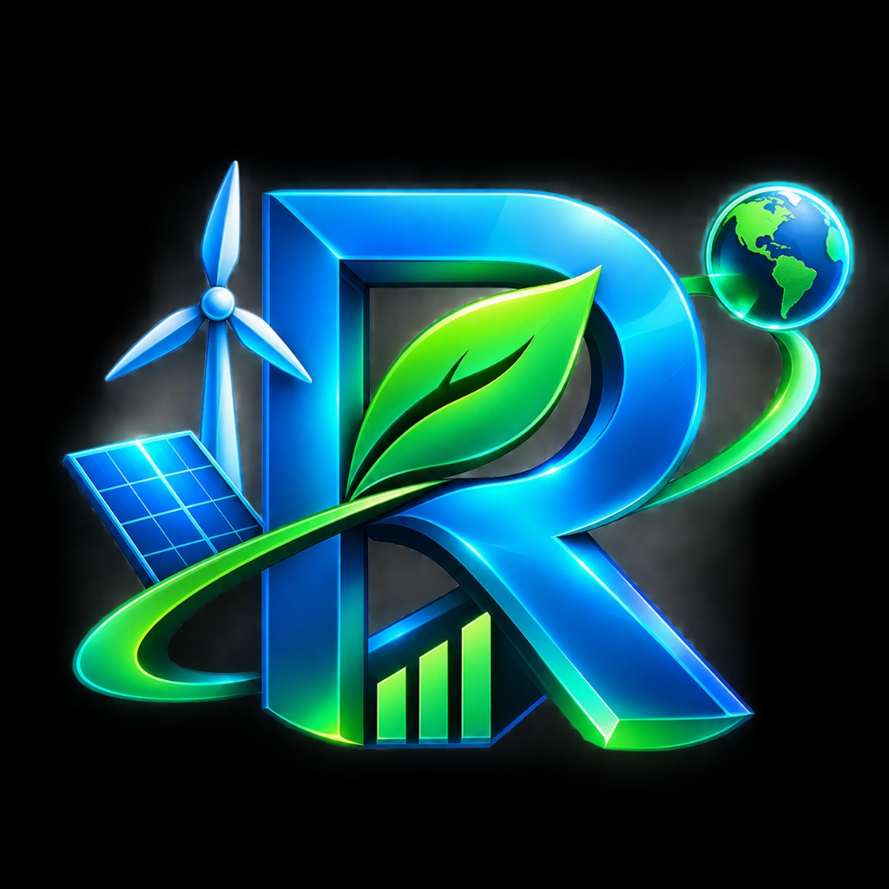

<div align="center">

  

  # ⚡ ReGenTech
  ### Intelligent Renewable & Sustainable Resource Management

  > **“Smarter Resources. Greener Future.”**

  [](https://sih.gov.in/)
  [](https://developer.mozilla.org/)
  [](#-ui--design-system)
  [](#-license)

  <p align="center">
    <b>A next-generation sustainability software prototype engineered for high-frequency renewable resource monitoring, machine-learning demand forecasting, real-time waste containment, and actionable facility optimization.</b>
  </p>

  [Explore Features](#-core-features--modules) •
  [Architecture](#-system-architecture--pipeline) •
  [Interactive Simulator](#-interactive-resource-simulator) •
  [Quick Start](#-quick-start) •
  [Roadmap](#-roadmap--future-scope)

</div>

---

## 📌 Executive Summary

**ReGenTech** addresses the fundamental gap in commercial and institutional sustainability operations: **the prediction deficit**. Traditional building management and energy systems identify resource waste hours or days after utility leakages occur. 

ReGenTech solves this through a synchronized four-stage computational workflow:
$$\text{Collect} \longrightarrow \text{Analyze} \longrightarrow \text{Predict} \longrightarrow \text{Optimize}$$

By continuously streaming simulated photovoltaic, micro-wind, and closed-loop water metrics into edge baseline models, the platform forecasts demand curves 7 to 90 days ahead, generating prescriptive interventions before resource wastage impacts municipal grids and carbon quotas.

---

## 🚀 Key Innovations & Highlights

- ⚡ **Zero External Framework Overhead**: 100% self-contained pure **HTML5**, modern **CSS3**, and modular **Vanilla JavaScript**. No React, Tailwind, Bootstrap, or Chart.js dependencies.
- 🎨 **Futuristic Light Design System**: Clean obsidian typography on crisp slate surfaces (`#f8fafc`, `#f1f5f9`), vivid emerald green accents (`#059669`), and cyber cyan highlights (`#0284c7`).
- 📈 **Custom Canvas Forecast Engine**: Pure HTML5 Canvas line chart displaying 6 historical points, an active pulsing current node, and 6 projected future intervals with dynamic confidence area shading across **7 / 30 / 90 days**.
- 🧮 **Real-Time Mathematical Simulator**: Live reactive sliders computing Net Utility Balance, Renewable Coverage %, Estimated Waste (kWh), Efficiency Score %, and CO₂ Offsets (Tons) in sub-millisecond intervals.
- 🧠 **AI Optimization Copilot**: Simulated intelligence engine synthesizing realistic time-of-use tariff shifts, diurnal thermal storage pre-cooling, and greywater recycling schedules.
- 🛡️ **Composite Eco Index**: Interactive circular radial gauge benchmarking five key sustainability categories (Energy Efficiency, Resource Utilization, Waste Management, Renewable Integration, Environmental Impact) scored at **87 / 100**.

---

## 🛠️ System Architecture & Pipeline

ReGenTech uses a decoupled telemetry and analytical pipeline designed for edge computing hardware and real-time dashboard responsiveness:

```mermaid
flowchart LR
    A["📡 Edge IoT & Meters\n(Solar, Wind, Water)"] --> B["⚡ Ingestion Layer\n(Modbus / MQTT)"]
    B --> C["🧠 AI Analytics Core\n(Baselines & Anomalies)"]
    C --> D["📈 ML Prediction Engine\n(7 / 30 / 90 Days)"]
    D --> E["💡 Optimization Copilot\n(Actionable Strategies)"]
    E --> F["🖥️ Dashboard Interface\n(Single-File Web UI)"]

    style A fill:#f1f5f9,stroke:#0284c7,stroke-width:2px,color:#0f172a
    style B fill:#f1f5f9,stroke:#059669,stroke-width:2px,color:#0f172a
    style C fill:#f1f5f9,stroke:#2563eb,stroke-width:2px,color:#0f172a
    style D fill:#f1f5f9,stroke:#059669,stroke-width:2px,color:#0f172a
    style E fill:#f1f5f9,stroke:#0284c7,stroke-width:2px,color:#0f172a
    style F fill:#f8fafc,stroke:#0f172a,stroke-width:2px,color:#0f172a
```



### Data Flow Breakdown
1. **User & Edge IoT**: Smart inverters, flow sensors, and meteorological monitors stream local telemetry.
2. **Dashboard UI**: Renders real-time telemetry gauges and updates live deltas every 3.6 seconds.
3. **Data Layer**: Normalizes sensor packets and checks equipment threshold health.
4. **AI Analysis**: Computes composite efficiency factors and flags phantom electrical draws.
5. **ML Prediction**: Generates 91% confidence interval demand trajectories.
6. **Recommendation Engine**: Dispatches load-shedding and battery arbitrage commands.

---

## 📦 Core Features & Modules

| Module | Description | Interactive Capabilities |
| :--- | :--- | :--- |
| **01 — Renewable Monitoring** | Tracks real-time photovoltaic arrays, wind micro-turbines, and rainwater recycling. | Sub-second telemetry simulation with dynamic status tags. |
| **02 — AI Analytics** | Normalizes raw logs into clear, actionable executive insights. | Automatic peak demand penalty isolation and baselining. |
| **03 — Predictive Forecasting** | Multi-variate time-series projections based on weather and historical demand. | 7, 30, and 90-day canvas line graph with confidence shading. |
| **04 — Waste Detection** | Identifies anomalous equipment phantom power leakages. | Click-to-expand telemetry architecture cards. |
| **05 — Optimization Engine** | Suggests peak-shifting strategies and dynamic battery charging cycles. | Dynamic load recommendations matching solar daylight peaks. |
| **06 — Sustainability Dashboard** | Centralized environmental performance metrics and CO₂ abatement. | Viewport-triggered count-up counters and circular gauge. |

---

## 🎛️ Interactive Resource Simulator

The embedded calculator allows facility managers and judges to simulate operational changes instantly:

### Formulas Implemented
- **Net Energy Balance**:
  $$\text{Net Energy (kWh)} = \text{Renewable Generation} - \text{Total Energy Usage}$$
- **Renewable Coverage**:
  $$\text{Coverage (\%)} = \left(\frac{\text{Renewable Generation}}{\text{Total Energy Usage}}\right) \times 100$$
- **Estimated Resource Waste**:
  $$\text{Waste (kWh)} = \text{Total Energy Usage} \times \left(\frac{\text{Waste Percentage}}{100}\right)$$
- **Efficiency Score**:
  $$\text{Score (\%)} = 100 - \text{Waste Percentage}$$
- **CO₂ Reduction Potential**:
  $$\text{CO}_2 \text{ Reduction (Tons)} = \frac{\text{Renewable Generation} \times 0.82}{1000}$$

---

## 💻 Quick Start

Because the entire application is crafted with pure web technologies and zero dependencies, setup takes under 5 seconds:

### 1. Direct Launch
Simply open `index.html` in any web browser:
- **Windows**: Double-click `index.html` or open in Chrome / Edge.
- **Mac / Linux**: Open in Safari, Chrome, or Firefox.

### 2. (Optional) Run with Local HTTP Server
If testing through a local server:

```bash
# Python 3
python -m http.server 8080

# Or Node.js
npx serve .
```
Then navigate to `http://localhost:8080`.

---

## 📂 Project Structure

```text
m:\SIH\ReGenTech landing page\
├── index.html           # Complete, self-contained single-file application
├── logo.jpg             # High-resolution 3D ReGenTech brand asset
└── README.md            # Comprehensive project documentation
```

---

## 🔮 Roadmap & Future Scope

```
[Phase 1: SIH 2026 Prototype] (Completed)
 ├── Single-file responsive interface
 ├── Canvas prediction chart (7/30/90 days)
 ├── Real-time mathematical resource simulator
 └── Simulated AI insight recommendation copilot

[Phase 2: Hardware & Edge Integration] (Planned)
 ├── Industrial Modbus, BACnet, and LoRaWAN gateway drivers
 ├── Smart meter two-way utility tariff handshake
 └── Real-time satellite solar irradiance API feeds

[Phase 3: Enterprise Machine Learning] (Planned)
 ├── LSTM and Transformer time-series models
 ├── Automated Scope 1, 2, and 3 GHG Protocol reporting
 └── Multi-tenant organization dashboard with alert escalation
```

---

## 🏆 Hackathon Details

- **Event**: Smart India Hackathon (SIH) 2026
- **Theme**: Clean & Green Technology / Renewable Energy Management
- **Project Name**: ReGenTech
- **Status**: Complete Working Prototype

---

## 📄 License

This software prototype is released under the **MIT License** for demonstration and educational purposes.  
© 2026 ReGenTech Team. All rights reserved.
